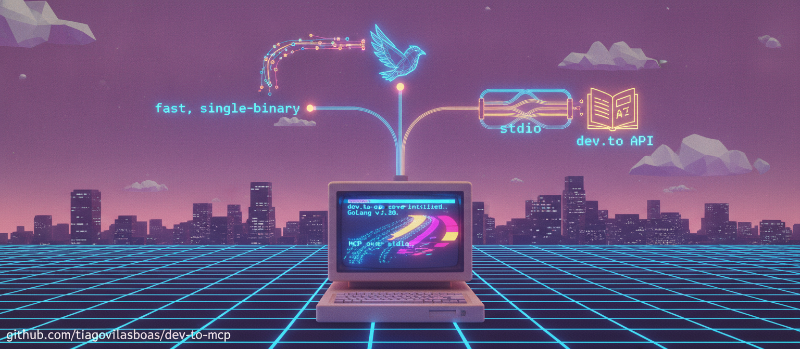

<p align="center">
  
</p>

<p align="center">
  <b>A fast, single-binary MCP server for the dev.to API</b><br>
  <sub>Written in Go. Speaks stdio. No servers, no cold starts.</sub>
</p>

<p align="center">
  <a href="https://go.dev/"></a>
  <a href="https://modelcontextprotocol.io/"></a>
  <a href="#"></a>
  <a href="LICENSE"></a>
</p>

<p align="center">
  <a href="#-install">Install</a> •
  <a href="#-tools">Tools</a> •
  <a href="#%EF%B8%8F-configure">Configure</a> •
  <a href="#-security">Security</a>
</p>

---

The MCP client (Kiro, Cursor, Claude Desktop, VS Code, …) launches the binary on demand and talks to it over stdin/stdout. There is no port and no long-lived HTTP server to fall over.

> [!NOTE]
> **AI-assisted project.** This server was designed and implemented with AI assistance (pair-programmed with an agent), then reviewed and tested by a human. Every design decision, security choice, and the code itself were verified before landing. Contributions are welcome under the same bar: reviewed and tested.

<br>

## ✨ Why Go + stdio

| | |
|:--|:--|
| **📦 Single binary** | No `npx` or `node_modules` download at startup — no cold-start timeout or network flakiness |
| **🔌 stdio, not HTTP** | The client owns the process. No `:3000` pinned in the background, no session bookkeeping |
| **🛡️ Resilient** | A failed dev.to call becomes a tool error the model can read and retry, not a dead server |
| **📝 Clean channel** | Logs go to stderr; stdout stays a pristine JSON-RPC stream |

Built on the official [`modelcontextprotocol/go-sdk`](https://github.com/modelcontextprotocol/go-sdk).

<br>

## 🛠 Tools

| Tool | Auth | Description |
|:-----|:----:|:------------|
| `get_articles` | — | List articles; filter by username, tag, state, or top (days) |
| `get_article` | — | One article by numeric `id` or `path` (`username/article-slug`) |
| `get_user` | — | User by `id` or `username` |
| `get_tags` | — | Popular tags, paginated |
| `get_comments` | — | Comment tree for an `article_id` |
| `search_articles` | — | Search articles by query |
| `create_article` | 🔑 | Create an article (draft by default) |
| `update_article` | 🔑 | Update an article by `id` |

> **Tip:** Publishing is `create_article` / `update_article` with `published: true`. Read tools work with no key at all.

<br>

## 📦 Install

Requires **Go 1.27+**.

```bash
git clone https://github.com/tiagovilasboas/dev-to-mcp.git
cd dev-to-mcp
go build -o dist/dev-to-mcp .
```

This produces a self-contained binary at `dist/dev-to-mcp`. Note the absolute path — you will point your MCP client at it.

<br>

## 🔑 Get a dev.to API key

The write tools need a personal API key. Generate one at:

**dev.to → Settings → Extensions → DEV Community API Keys**  
👉 [Direct link](https://dev.to/settings/extensions)

Read tools need nothing.

<br>

## 🔐 Store the key securely

> **Never put your key in a config file that can be committed to git.**

<details open>
<summary><b>macOS — Keychain</b> (recommended)</summary>

<br>

The binary reads the key straight from the macOS Keychain:

```bash
security add-generic-password -s dev-to-mcp -a "$(id -un)" -w "YOUR_DEV_TO_API_KEY" -U
```

That's it. The server finds it automatically (service `dev-to-mcp`, account = your OS user).

</details>

<details>
<summary><b>Linux / Windows — environment via a vault</b></summary>

<br>

Native Keychain lookup is macOS-only. On Linux/Windows, feed the key through `DEV_TO_API_KEY`:

| Vault | Example |
|:------|:--------|
| **1Password CLI** | `op run -- dist/dev-to-mcp` with `DEV_TO_API_KEY=op://vault/dev-to/key` |
| **pass** | `DEV_TO_API_KEY=$(pass dev-to/api-key) dist/dev-to-mcp` |

</details>

<br>

## ⚙️ Configure

Point your MCP client at the compiled binary using its **absolute path**.

<details open>
<summary><b>Kiro</b></summary>

`.kiro/settings/mcp.json` (workspace) or `~/.kiro/settings/mcp.json` (global)

```json
{
  "mcpServers": {
    "dev-to": {
      "command": "/absolute/path/to/dev-to-mcp/dist/dev-to-mcp"
    }
  }
}
```

</details>

<details>
<summary><b>Cursor</b></summary>

`~/.cursor/mcp.json` or `.cursor/mcp.json`

```json
{
  "mcpServers": {
    "dev-to": {
      "command": "/absolute/path/to/dev-to-mcp/dist/dev-to-mcp"
    }
  }
}
```

</details>

<details>
<summary><b>Claude Desktop</b></summary>

`claude_desktop_config.json`

```json
{
  "mcpServers": {
    "dev-to": {
      "command": "/absolute/path/to/dev-to-mcp/dist/dev-to-mcp"
    }
  }
}
```

</details>

<details>
<summary><b>VS Code</b> (Continue / Cline / other MCP extensions)</summary>

```json
{
  "mcpServers": {
    "dev-to": {
      "command": "/absolute/path/to/dev-to-mcp/dist/dev-to-mcp"
    }
  }
}
```

</details>

<details>
<summary><b>With environment variable</b> (Linux/Windows)</summary>

Add an `env` block — and keep that file out of git:

```json
{
  "mcpServers": {
    "dev-to": {
      "command": "/absolute/path/to/dev-to-mcp/dist/dev-to-mcp",
      "env": { "DEV_TO_API_KEY": "YOUR_DEV_TO_API_KEY" }
    }
  }
}
```

</details>

<br>

## 🛡 Security

<table>
<tr>
<td width="50%">

**What this server does**

- 🔒 Vault-first key handling — on macOS the key is read from Keychain
- 🚫 The token is never logged
- 🔐 No key in the repo — nothing hardcoded
- ➡️ Token pass-through only — sent to `dev.to` and nowhere else
- 📄 Responses pass through unchanged — no third-party endpoints

</td>
<td width="50%">

**What you should do**

- Keep your key in a vault (Keychain / 1Password / `pass`)
- Ensure any file with `DEV_TO_API_KEY` is git-ignored
- Rotate the key at dev.to if you suspect exposure

</td>
</tr>
</table>

> [!WARNING]
> Write tools (`create_article`, `update_article`) publish to your real dev.to account with **no extra confirmation** — approval is expected from your MCP client's tool-approval prompt. Review calls before you approve.

<br>

## 📋 Configuration reference

All optional. Sensible defaults mean macOS users configure nothing.

| Variable | Default | Purpose |
|:---------|:--------|:--------|
| `DEV_TO_API_KEY` | — | API key fallback when Keychain has no entry |
| `DEVTO_KEYCHAIN_SERVICE` | `dev-to-mcp` | macOS Keychain service name |
| `DEVTO_KEYCHAIN_ACCOUNT` | current OS user | macOS Keychain account name |

**Resolution order:** Keychain → `DEV_TO_API_KEY`

<br>

## 📁 Project layout

```
main.go                        bootstrap: resolve token, build server, run stdio
internal/keychain/keychain.go  read a secret from the macOS Keychain (no CGO)
internal/devto/
├── client.go                  HTTP transport: get / writeArticle / do
├── endpoints.go               one method per dev.to endpoint
├── tools.go                   register the 8 MCP tools
└── inputs.go                  typed tool inputs + query/body builders
```

One responsibility per file. Responses flow back as raw dev.to JSON — the consumer is an LLM that reads JSON, so there are no response structs to keep in sync with the upstream API.

<br>

---

<p align="center">
  <sub>MIT License • Made with 🤖 + 👨‍💻</sub>
</p>
